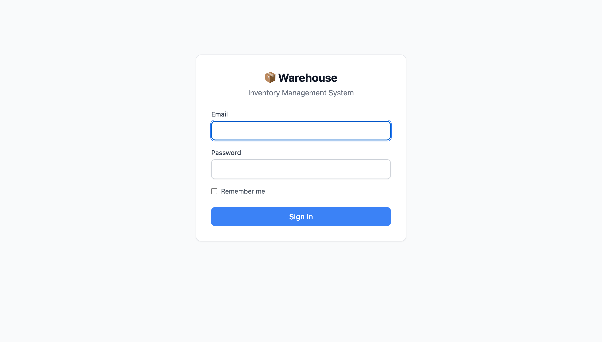
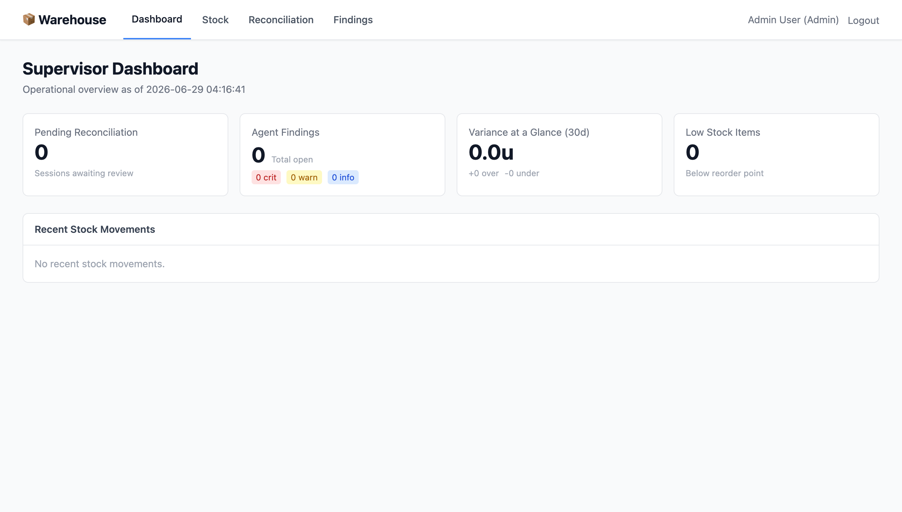
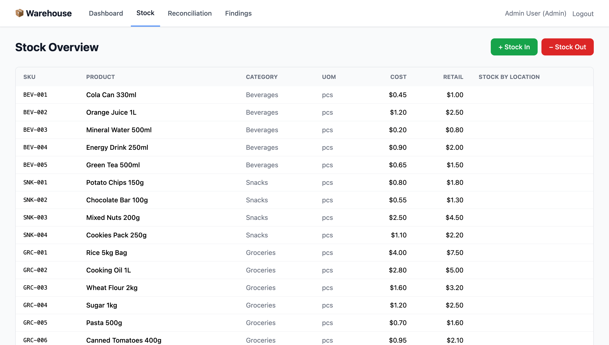
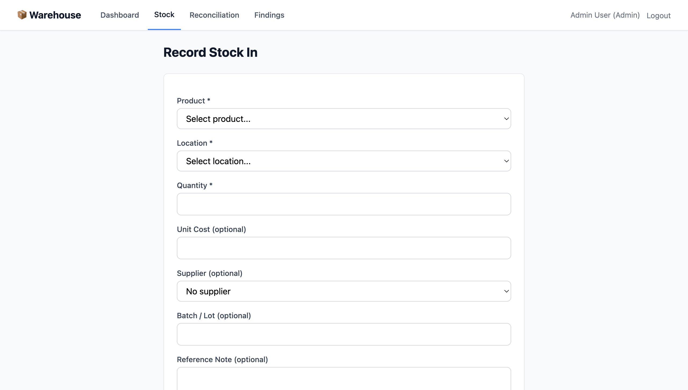
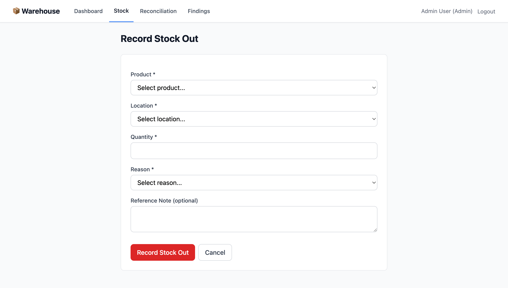
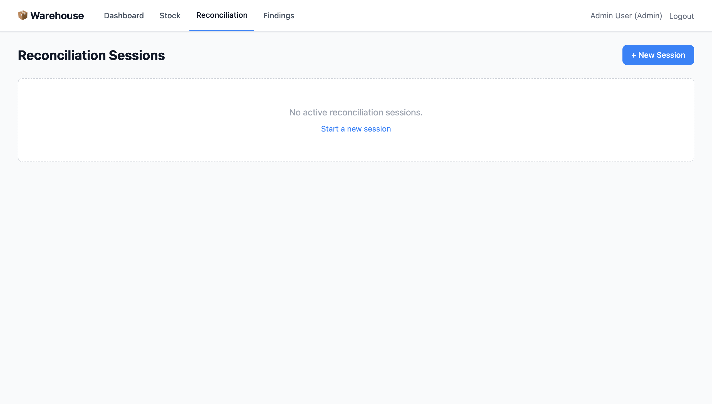
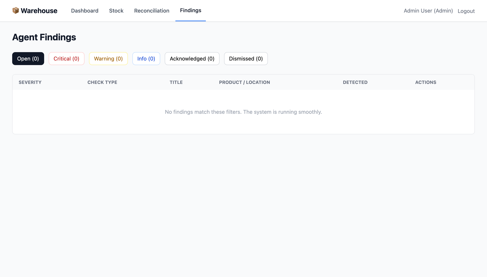
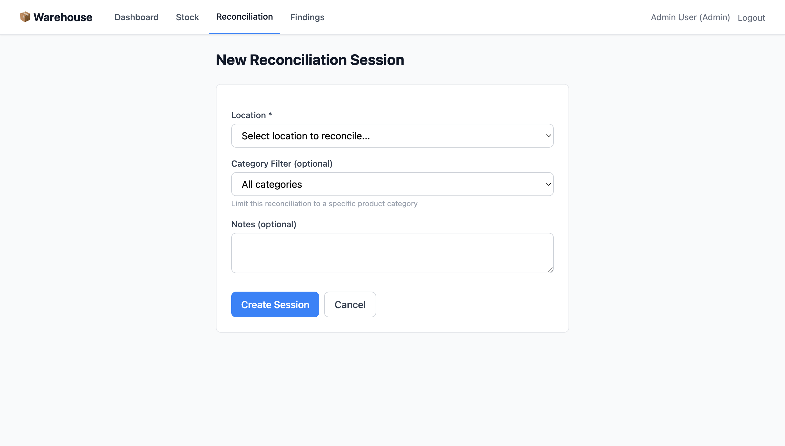

# Warehouse
### Inventory Control Platform

A warehouse and mini-market inventory platform that controls inventory through approvals, transaction history, and reconciliation.

---

## Login

Secure role-based access with three tiers — **Admin**, **Supervisor**, and **Agent**.

---

## Dashboard

One screen. Four key metrics — pending reconciliation, agent findings, 30-day variance, and low stock alerts.

---

## Stock Overview

Real-time inventory across **20 SKUs**, **5 locations** (2 warehouses, 3 stores), and **5 suppliers**.

---

## Stock In

Record incoming inventory with append-only transaction ledger. Every movement is immutable and traceable.

---

## Stock Out

Dispatch inventory with **pessimistic locking** — no double-ships, no race conditions, no negative stock.

---

## Reconciliation

6-stage gated pipeline: `draft → in_progress → submitted → under_review → closed`

---

## Agent Findings

8 autonomous anomaly checks — negative stock, dormant items, rapid depletion, duplicate movements, and more. Deduplicated by content hash.

---

## Create Reconciliation

Start a cycle count by location with optional category filter. Large variances (>5% or 50 units) require a different supervisor to approve.

---

## Stack

| Layer | Choice |
|---|---|
| Framework | Laravel 12, PHP 8.4-FPM |
| Database | MySQL 8.0 |
| Cache / Queue | Redis 7 |
| Web Server | Nginx (Alpine) |
| Frontend | Blade + Tailwind CSS |
| Orchestration | Docker Compose |

> `docker compose up -d --build` — 5 services, health-checked startups.
